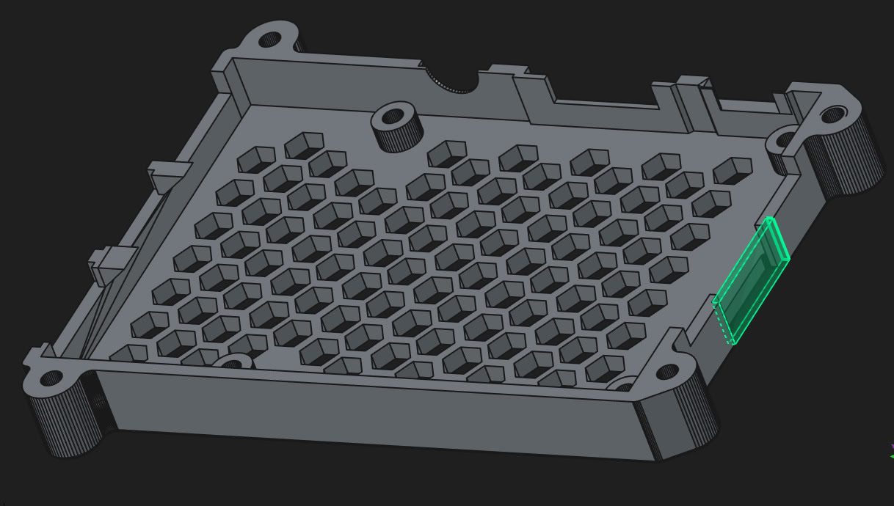

# enclosure for my rpi2

Unfortunately, the sd card reader holder is b0rked and I had to modify top part of the enclosure to make sure sd card keep being inside. 
The below is snippet of the modification I did.

- https://www.printables.com/model/408695-raspberry-pi-2-3-3b-case-for-diy-3d-printer-enclos

