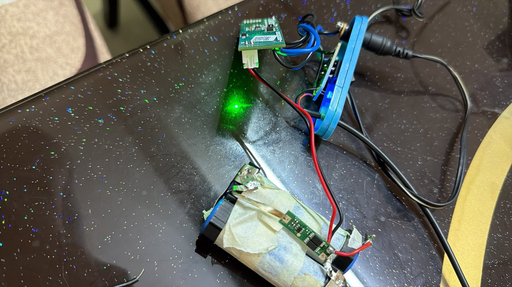

# Oakter UPS for router 

overpriced shit - did not work for more than 2 years

## Issue
2S series batteries - both batteries were dead

## BMS
BMS went into safety mode. P+ and P- voltage was 1.49V even the new batteries were fully charged

Below are the steps to reset the BMS (2S1P)

1. disconnect the batteries
2. put 8.4v to P+/P- of BMS
3. short B- and P- 

## What I did

1. made a fresh 2S1P battery pack with salvaged batteries. new welder came pretty handy
2. printed and designed the 2x1 battery holder
3. destroyed the oakter enclosure - needs a redesign
4. had to reset the BMS. Check [RESET BMS](#bms)

## TODOs
Design an enclosure to fit everything nicely.
